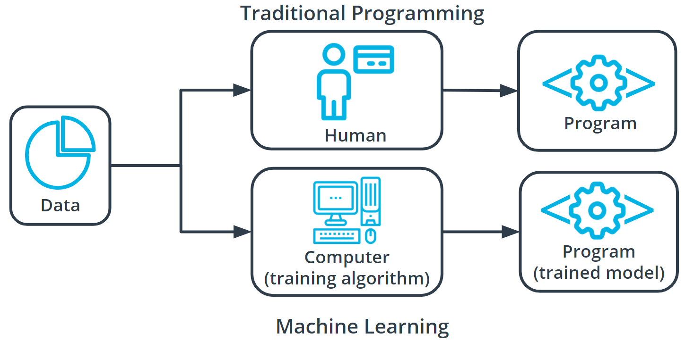

# What is Machine Learning?
## Summary
Machine learning is part of broader field of artifical intelligence. This field is concerned with the capability of machines to performs activities using human-like intelligence. Withthin machine learning, there are several diffirent kinds of tasks or techniques:
* In supervised learning, every traning sample from the dataset has a corresponding label or output value associated with it. As a result, the algorithm learns to predict labels or output values.
* In unsupervised learning, there are no labels for the training data. A machine learning algorithm tries to learn the underlying patterns or distributions that govern the data.
* In reinforcement learning, the algorithm figures out which actions to take in a situation to maximize a reward (in the form of number) on the way to reaching a specific goal. This is a completely different approach than supervised and unsupervised learning.
  

In traditional problem-solving with software, a person analyzes a problem and engineers a solution in code to solve that problem. For many real-world problems, this process can be laborious (or even impossible) because a correct solution would need to consider a vast number of edge cases.

Imagine, for example, the challenging task of writing a program that can detect if a cat is present in an image. Solving this in the traditional way would require careful attention to details like varying lighting conditions, different types of cats, and various poses a cat might be in.

In machine learning, the problem solver abstracts away part of their solution as a flexible component called a model, and uses a special program called a model training algorithm to adjust that model to real-world data. The result is a trained model which can be used to predict outcomes that are not part of the data set used to train it.

In a way, machine learning automates some of the statistical reasoning and pattern-matching the problem solver would traditionally do.

The overall goal is to use a model created by a model training algorithm to generate predictions or find patterns in data that can be used to solve a problem.

# Components of machine learning
Nearly all tasks solved with machine learning involve three primary components:
* A machine learning model
* A model training program
* A model inference algorithm

## What are machine learning models?
A machine learning model can be molded into mnay different forms and serve many different purposes. A model is an extremly generic program or block of code, made specific by the data used to train it. It is used to solve different problems.